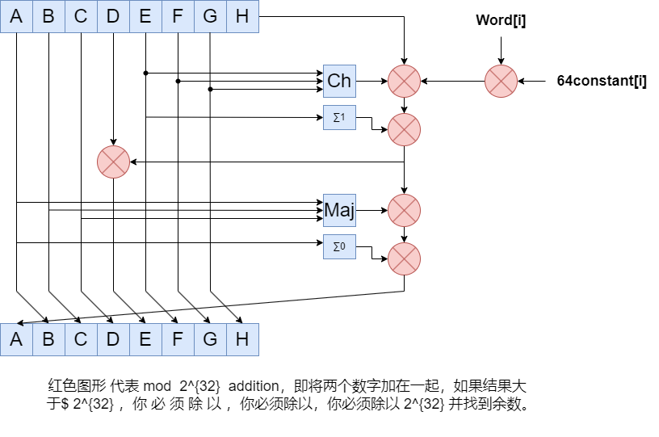

# SHA 256 简介

​		SHA-256是一种散列（哈希）算法，用于将任意长度的数据映射为固定长度的散列值，以保证数据完整性。 SHA-256是SHA（Secure Hash Algorithm）系列中的一种，其输出结果为256位（32字节）散列值。


# SHA256原理详解


### 常量

**8个哈希初值**

```bash
h0 := 0x6a09e667
h1 := 0xbb67ae85
h2 := 0x3c6ef372
h3 := 0xa54ff53a
h4 := 0x510e527f
h5 := 0x9b05688c
h6 := 0x1f83d9ab
h7 := 0x5be0cd19
```

这些初值是对自然数中前8个质数（2,3,5,7,11,13,17,19）的平方根的小数部分取前32bit而来

**64个常量**

```bash
428a2f98 71374491 b5c0fbcf e9b5dba5
3956c25b 59f111f1 923f82a4 ab1c5ed5
d807aa98 12835b01 243185be 550c7dc3
72be5d74 80deb1fe 9bdc06a7 c19bf174
e49b69c1 efbe4786 0fc19dc6 240ca1cc
2de92c6f 4a7484aa 5cb0a9dc 76f988da
983e5152 a831c66d b00327c8 bf597fc7
c6e00bf3 d5a79147 06ca6351 14292967
27b70a85 2e1b2138 4d2c6dfc 53380d13
650a7354 766a0abb 81c2c92e 92722c85
a2bfe8a1 a81a664b c24b8b70 c76c51a3
d192e819 d6990624 f40e3585 106aa070
19a4c116 1e376c08 2748774c 34b0bcb5
391c0cb3 4ed8aa4a 5b9cca4f 682e6ff3
748f82ee 78a5636f 84c87814 8cc70208
90befffa a4506ceb bef9a3f7 c67178f2
```

​		和8个哈希初值类似，这些常量是对自然数中前64个质数(2,3,5,7,11,13,17,19,23,29,31,37,41,43,47,5359,61,67,71,73,79,83,89,97…)的立方根的小数部分取前32bit而来。


## 信息预处理(pre-processing)

SHA256算法中的预处理就是在想要Hash的消息后面补充需要的信息，使整个消息满足指定的结构。

信息的预处理分为两个步骤：`附加填充比特`和`附加长度`

### STEP1：附加填充比特

在报文末尾进行填充，使报文长度在对512取模以后的余数是448

填充是这样进行的：先补第一个比特为1，然后都补0，直到长度满足对512取模后余数是448。

需要注意的是，信息必须进行填充，也就是说，即使长度已经满足对512取模后余数是448，补位也必须要进行，这时要填充512个比特。

因此，填充是至少补一位，最多补512位。

例：以信息“abc”为例显示补位的过程。

a,b,c对应的ASCII码分别是97,98,99

于是原始信息的二进制编码为：01100001 01100010 01100011

补位第一步，首先补一个“1” ： 0110000101100010 01100011 1

补位第二步,补423个“0”：01100001 01100010 01100011 10000000 00000000 … 00000000

补位完成后的数据如下（为了简介用16进制表示）：

```bash
61626380 00000000 00000000 00000000
00000000 00000000 00000000 00000000
00000000 00000000 00000000 00000000
00000000 00000000
```

为什么是448?

因为在第一步的预处理后，第二步会再附加上一个64bit的数据，用来表示原始报文的长度信息。而448+64=512，正好拼成了一个完整的结构。

### STEP2：附加长度值

附加长度值就是将原始数据（第一步填充前的消息）的长度信息补到已经进行了填充操作的消息后面。

wiki百科中给出的原文是：append length of message (before pre-processing), in bits, as 64-bit big-endian integer

SHA256用一个64位的数据来表示原始消息的长度。

因此，通过SHA256计算的消息长度必须要小于$ 2^64 $，当然绝大多数情况这足够大了。

长度信息的编码方式为64-bit big-endian integer

关于Big endian的含义，文末给出了补充

回到刚刚的例子，消息“abc”，3个字符，占用24个bit

因此，在进行了补长度的操作以后，整个消息就变成下面这样了（16进制格式）

```bash
61626380 00000000 00000000 00000000
00000000 00000000 00000000 00000000
00000000 00000000 00000000 00000000
00000000 00000000 00000000 00000018
```

## 逻辑运算

包括如下的逻辑函数：

$C_h(x,y,z) = (x ∧ y) ⊕ (¬x ∧ z)$

$Ma(x,y,z) = (x ∧ y) ⊕ (x ∧ z) ⊕ (y ∧ z)$

$Σ_0(x) = S^2(x) ⊕ S^{13}(x) ⊕ S^{22}(x)$

$Σ_1(x) = S^6(x) ⊕ S^{11}(x) ⊕ S^{25}(x)$

$σ_0(x) = S^7(x) ⊕ S^{18}(x) ⊕ R^3(x)$

$σ_1(x) = S^{17}(x) ⊕ S^{19}(x) ⊕ R^{10}(x)$

**说明：**

**∧: 按位“与”**
**¬: 按位“补”**
**⊕: 按位“异或”**
**S^n: 循环右移n个bit**
**R^n: 右移n个bit**


## 计算消息摘要


**首先：将消息分解成512-bit大小的块**

**STEP1：构造64个字（word）**

对于每一块，将块分解为16个32-bit的big-endian的字，记为**w[0], …, w[15]**

也就是说，前16个字直接由消息的第i个块分解得到

其余的字由如下迭代公式得到：

​                                                    $W_t = σ1(W_{t-2}) + W_{t-7} + σ0(W_{t-15}) + W_{t-16}$


**STEP2：进行64次循环**




最后一次循环所产生的八个字合起来即是第i个块对应到的散列字符串


伪代码：

```bash
Note: All variables are unsigned 32 bits and wrap modulo 232 when calculating


Initialize variables
(first 32 bits of the fractional parts of the square roots of the first 8 primes 2..19):
h0 := 0x6a09e667
h1 := 0xbb67ae85
h2 := 0x3c6ef372
h3 := 0xa54ff53a
h4 := 0x510e527f
h5 := 0x9b05688c
h6 := 0x1f83d9ab
h7 := 0x5be0cd19


Initialize table of round constants
(first 32 bits of the fractional parts of the cube roots of the first 64 primes 2..311):
k[0..63] :=
   0x428a2f98, 0x71374491, 0xb5c0fbcf, 0xe9b5dba5, 0x3956c25b, 0x59f111f1, 0x923f82a4, 0xab1c5ed5,
   0xd807aa98, 0x12835b01, 0x243185be, 0x550c7dc3, 0x72be5d74, 0x80deb1fe, 0x9bdc06a7, 0xc19bf174,
   0xe49b69c1, 0xefbe4786, 0x0fc19dc6, 0x240ca1cc, 0x2de92c6f, 0x4a7484aa, 0x5cb0a9dc, 0x76f988da,
   0x983e5152, 0xa831c66d, 0xb00327c8, 0xbf597fc7, 0xc6e00bf3, 0xd5a79147, 0x06ca6351, 0x14292967,
   0x27b70a85, 0x2e1b2138, 0x4d2c6dfc, 0x53380d13, 0x650a7354, 0x766a0abb, 0x81c2c92e, 0x92722c85,
   0xa2bfe8a1, 0xa81a664b, 0xc24b8b70, 0xc76c51a3, 0xd192e819, 0xd6990624, 0xf40e3585, 0x106aa070,
   0x19a4c116, 0x1e376c08, 0x2748774c, 0x34b0bcb5, 0x391c0cb3, 0x4ed8aa4a, 0x5b9cca4f, 0x682e6ff3,
   0x748f82ee, 0x78a5636f, 0x84c87814, 0x8cc70208, 0x90befffa, 0xa4506ceb, 0xbef9a3f7, 0xc67178f2


Pre-processing:
append the bit '1' to the message
append k bits '0', where k is the minimum number >= 0 such that the resulting message
    length (in bits) is congruent to 448(mod 512)
append length of message (before pre-processing), in bits, as 64-bit big-endian integer


Process the message in successive 512-bit chunks:
break message into 512-bit chunks
for each chunk
    break chunk into sixteen 32-bit big-endian words w[0..15]

    Extend the sixteen 32-bit words into sixty-four 32-bit words:
    for i from 16 to 63
        s0 := (w[i-15] rightrotate 7) xor (w[i-15] rightrotate 18) xor(w[i-15] rightshift 3)
        s1 := (w[i-2] rightrotate 17) xor (w[i-2] rightrotate 19) xor(w[i-2] rightshift 10)
        w[i] := w[i-16] + s0 + w[i-7] + s1

    Initialize hash value for this chunk:
    a := h0
    b := h1
    c := h2
    d := h3
    e := h4
    f := h5
    g := h6
    h := h7

    Main loop:
    for i from 0 to 63
        s0 := (a rightrotate 2) xor (a rightrotate 13) xor(a rightrotate 22)
        maj := (a and b) xor (a and c) xor(b and c)
        t2 := s0 + maj
        s1 := (e rightrotate 6) xor (e rightrotate 11) xor(e rightrotate 25)
        ch := (e and f) xor ((not e) and g)
        t1 := h + s1 + ch + k[i] + w[i]
        h := g
        g := f
        f := e
        e := d + t1
        d := c
        c := b
        b := a
        a := t1 + t2

    Add this chunk's hash to result so far:
    h0 := h0 + a
    h1 := h1 + b
    h2 := h2 + c
    h3 := h3 + d
    h4 := h4 + e
    h5 := h5 + f
    h6 := h6 + g
    h7 := h7 + h

Produce the final hash value (big-endian):
digest = hash = h0 append h1 append h2 append h3 append h4 append h5 append h6 append h7

```

